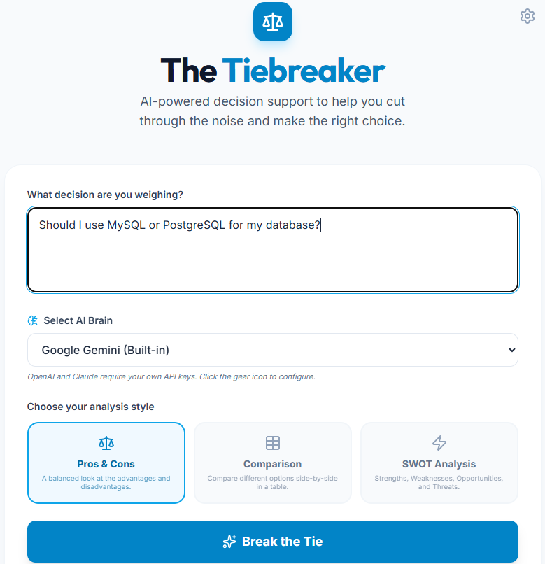
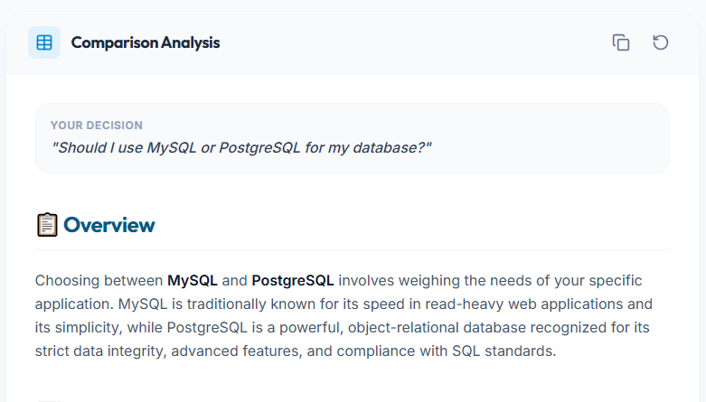
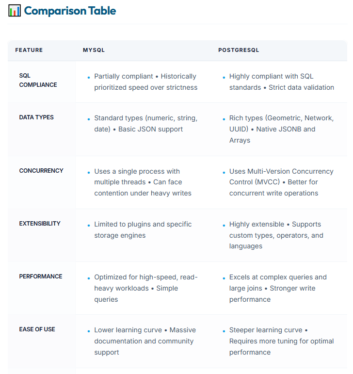
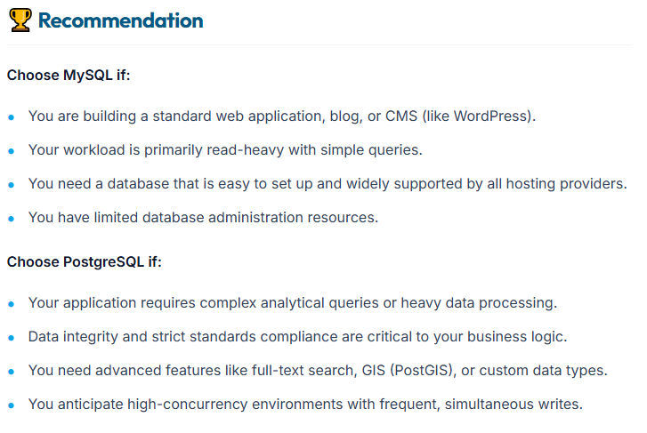

# ⚖️ The Tiebreaker

**The Tiebreaker** is a professional, AI-powered decision-support application designed to help users overcome analysis paralysis. By leveraging multiple Large Language Models (LLMs), it provides structured, objective insights into complex choices.


## 🚀 Features

- **Multi-Model Support**: Choose your "Brain" from Google Gemini, OpenAI (GPT-4o), or Anthropic (Claude 3.5 Sonnet).
- **Structured Analysis**:
  - **✅ Pros & Cons**: A balanced look at advantages and disadvantages.
  - **📊 Comparison Table**: Side-by-side evaluation of multiple options.
  - **💪 SWOT Analysis**: Deep dive into Strengths, Weaknesses, Opportunities, and Threats.
- **Bring Your Own Key (BYOK)**: Securely use your own API keys stored locally in your browser.
- **Modern UI**: Clean, responsive design built with Tailwind CSS and Framer Motion.
- **Copy to Clipboard**: Easily export your analysis for use in documents or messages.

## ✨ Visual Tour

<details>
  <summary>📸 <b>1. The Command Center</b> (Click to expand ↴)</summary>
  <p align="center">
    <br>
    
    <br>
    <i>A clean, focused workspace designed to help you think clearly and select the right AI brain.</i>
  </p>
</details>

<details>
  <summary>🔍 <b>2. Deep Context Overview</b> (Click to expand ↴)</summary>
  <p align="center">
    <br>
    
    <br>
    <i>Intelligent framing that captures the nuance of your specific decision context.</i>
  </p>
</details>

<details>
  <summary>📊 <b>3. Comparison Matrix</b> (Click to expand ↴)</summary>
  <p align="center">
    <br>
    
    <br>
    <i>Professional side-by-side breakdown for objective evaluation of features and trade-offs.</i>
  </p>
</details>

<details>
  <summary>🏆 <b>4. Strategic Recommendation</b> (Click to expand ↴)</summary>
  <p align="center">
    <br>
    
    <br>
    <i>Actionable insights and a final verdict to help you move forward with confidence.</i>
  </p>
</details>

## 🛠️ Tech Stack

- **Frontend**: React 19, Vite, Tailwind CSS, Lucide Icons, Framer Motion.
- **Backend**: Node.js, Express (serving as a secure proxy for AI requests).
- **AI Integration**: [Vercel AI SDK](https://sdk.vercel.ai/) for unified provider management.

## 📦 Installation

1. **Clone the repository**:
   ```bash
   git clone https://github.com/your-username/the-tiebreaker.git
   cd the-tiebreaker
   ```

2. **Install dependencies**:
   ```bash
   npm install
   ```

3. **Set up environment variables**:
   Create a `.env` file in the root directory:
   ```env
   GEMINI_API_KEY=your_gemini_key_here
   # OpenAI and Claude keys can be entered in the UI
   ```

4. **Run the development server**:
   ```bash
   npm run dev
   ```
   The app will be available at `http://localhost:3000`.

## ☁️ Deployment

### Render / Railway / Heroku
This is a full-stack app. Ensure your deployment platform runs the `start` command:
1. **Build Command**: `npm run build`
2. **Start Command**: `node server.ts` (or `npm start` if configured)
3. **Environment Variables**: Add `GEMINI_API_KEY`, `OPENAI_API_KEY`, etc., in your platform's dashboard.

## 🔒 Security (BYOK Architecture)

This project uses a "Bring Your Own Key" model for OpenAI and Claude:
1. User enters their key in the **Settings** modal.
2. The key is saved to `localStorage` (browser-only).
3. When an analysis is requested, the key is sent via an encrypted HTTPS header to the backend.
4. The backend uses the key for a single request and never persists it.

## 🤝 Contributing

Contributions are welcome! Please feel free to submit a Pull Request.

## 📄 License

This project is licensed under the MIT License.
